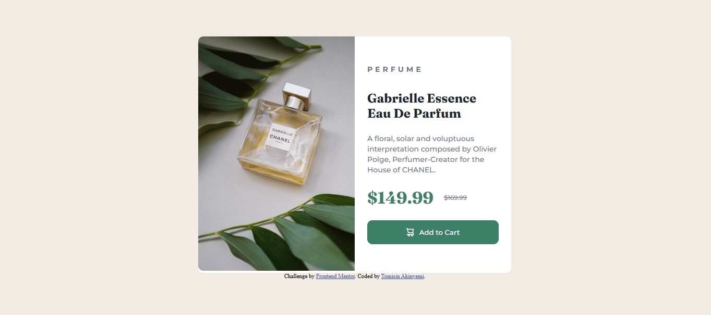

# Frontend Mentor - Product preview card component solution

This is a solution to the [Product preview card component challenge on Frontend Mentor](https://www.frontendmentor.io/challenges/product-preview-card-component-GO7UmttRfa). Frontend Mentor challenges help you improve your coding skills by building realistic projects.

## Table of contents

- [Overview](#overview)
  - [The challenge](#the-challenge)
  - [Screenshot](#screenshot)
  - [Links](#links)
- [My process](#my-process)
  - [Built with](#built-with)
  - [What I learned](#what-i-learned)
  - [Continued development](#continued-development)
- [Author](#author)

**Note: Delete this note and update the table of contents based on what sections you keep.**

## Overview

### The challenge

Users should be able to:

- View the optimal layout depending on their device's screen size
- See hover and focus states for interactive elements

### Screenshot

### Links

- Solution URL: [Add solution URL here](https://github.com/donttouchtomi/Product-Review.git)
- Live Site URL: [Add live site URL here](https://admirable-taffy-9e8ed5.netlify.app/)

## My process

### Built with

- Semantic HTML5 markup
- CSS custom properties
- Flexbox

### What I learned

While doing this project i learnt hot to use the flex-wrap, flex-grow, flex-shrink, flex-basis and the max-width property, To be honest it was sooo hard trying to get my code to wrap but i was finally able to do it

### Continued development

I need to really work on my knowledge of Grid, Flex and Max-Width properties

## Author

- Frontend Mentor - [@donttouchtomi](https://www.frontendmentor.io/profile/donttouchtomi)
- Twitter - [@donttouch_tomi](https://www.twitter.com/donttouch_tomi)
